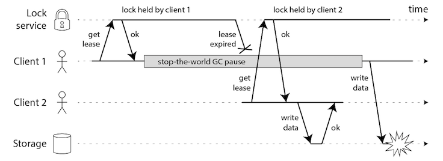
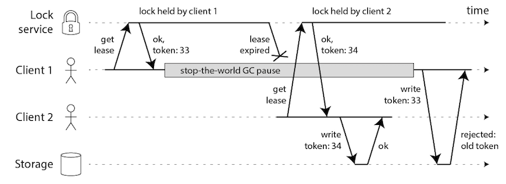

title: 聊一聊分布式锁的设计
categories: 分布式
tags: 
- 分布式
- redis
- zookeeper
- 分布式锁
date: 2016-02-24 00:00:00

---

## 起因

前段时间，看到redis作者发布的一篇文章[《Is Redlock safe?》](http://antirez.com/news/101)，Redlock是redis作者基于redis设计的分布式锁的算法。文章起因是有一位分布式的专家写了一篇文章[《How to do distributed locking》](http://martin.kleppmann.com/2016/02/08/how-to-do-distributed-locking.html)，质疑Redlock的正确性。redis作者则在《Is Redlock safe?》文章中给予回应，一来一回甚是精彩。文本就为读者一一解析两位专家的争论。

在了解两位专家的争论前，让我先从我了解的分布式锁一一道来。

## 数据库锁表

我第一次接触分布式锁用的是mysql的锁表。当时我并没有分布式锁的概念。只知道当时有两台交易中心服务器处理相同的业务，每个交易中心处理订单的时候需要保证另一个无法处理。于是用mysql的一张表来控制共享资源。表结构如下：

	CREATE TABLE `lockedOrder` (
	  `id` int(11) NOT NULL AUTO_INCREMENT COMMENT '主码',
	  `type` tinyint(8) unsigned NOT NULL DEFAULT '0' COMMENT '操作类别',
	  `order_id` varchar(64) NOT NULL DEFAULT '' COMMENT '锁定的order_id',
	  `memo` varchar(1024) NOT NULL DEFAULT '',
	  `update_time` timestamp NOT NULL DEFAULT CURRENT_TIMESTAMP ON UPDATE CURRENT_TIMESTAMP COMMENT '保存数据时间，自动生成',
	  PRIMARY KEY (`id`),
	  UNIQUE KEY `uidx_order_id` (`order_id`) USING BTREE
	) ENGINE=InnoDB DEFAULT CHARSET=utf8 COMMENT='锁定中的订单';
	
order_id记录了订单号，type和memo用来记录下是那种类型的操作锁定的订单，memo用来记录一下操作内容。这张表能完成分布式锁的主要原因正是由于把order_id设置为了`UNIQUE KEY`，所以同一个订单号只能插入一次。于是对锁的竞争就交给了数据库，处理同一个订单号的交易中心把订单号插入表中，数据库保证了只有一个交易中心能插入成功，其他交易中心都会插入失败。lock和unlock的伪代码也非常简单：

	def lock ：
		exec sql: insert into lockedOrder(type,order_id,memo) values (type,order_id,memo)
		if result == true :
			return true
		else :
			return false

	def unlock ：
		exec sql: delete from lockedOrder where order_id='order_id'
		
读者可以发现，这个锁从功能上有几个问题：

*	数据库锁实现只能是非阻塞锁，即应该为tryLock，是尝试获得锁，如果无法获得则会返回失败。要改成阻塞锁，需要反复执行insert语句直到插入成功。由于交易中心的使用场景，只要一个交易中心处理订单就行了，所以这里不需要使用阻塞锁。
*	这把锁没有过期时间，如果交易中心锁定了订单，但异常宕机后，这个订单就无法锁定了。这里为了让锁能够失效，需要在应用层加上定时任务，去删除过期还未解锁的订单。clear_timeout_lock的伪代码很简单，只要执行一条sql即可。

		def clear_timeout_lock :
			exec sql : delete from lockedOrder where update_time <  ADDTIME(NOW(),'-00:02:00')
			
	这里设置过期时间为2分钟，也是从业务场景考虑的，如果订单处理时间可能超过2分钟的话，这个时候还需要加大。
*	这把锁是不能重入的，意思就是即使一个交易中心获得了锁，在它为解锁前，之后的流程如果有再去获取锁的话还会失败，这样就可能出现死锁。这个问题我们当时没有处理，如果要处理这个问题的话，需要增加字段，在insert的时候，把该交易中心的标识加进来，这样再获取锁的时候， 通过select，看下锁定的人是不是自己。lock的伪代码版本如下：

		def lock ：
			exec sql: insert into lockedOrder(type,order_id,memo) values (type,order_id,memo)
			if result == true :
				return true
			else :
				exec sql : select id from lockedOrder where order_id='order_id' and memo = 'TradeCenterId'
				if count > 0 :
					return true
				else 
					return false
	
	在锁定失败后，看下锁是不是自己，如果是自己，那依然锁定成功。不过这个方法解锁又遇到了困难，第一次unlock就把锁给释放了，后面的流程都是在没锁的情况下完成，就可能出现其他交易中心也获取到这个订单锁，产生冲突。解决这个办法的方法就是给锁加计数器，记录下lock多少次。unlock的时候，只有在lock次数为0后才能删除数据库的记录。
	
可以看出，数据库锁能实现一个简单的避免共享资源被多个系统操作的情况。我以前在盛大的时候，发现盛大特别喜欢用数据库锁。盛大的前辈们会说，盛大基本上实现分布式锁用的都是数据库锁。在并发量不是那么恐怖的情况下，数据库锁的性能也不容易出问题，而且由于数据库的数据具有持久化的特性，一般的应用也足够应付。但是除了上面说的数据库锁的几个功能问题外，数据库锁并没有很好的应付数据库宕机的场景，如果数据库宕机，会带来的整个交易中心无法工作。当时我也没想过这个问题，我们整个交易系统，数据库是个单点，不过数据库实在是太稳定了，两年也没出过任何问题。随着工作经验的积累，构建高可用系统的概念越来越强，系统中是不允许出现单点的。现在想想，通过数据库的同步复制，以及使用vip切换Master就能解决这个问题。

## 缓存锁

后来我开始接触缓存服务，知道很多应用都把缓存作为分布式锁，比如redis。使用缓存作为分布式锁，性能非常强劲，在一些不错的硬件上，redis可以每秒执行10w次，内网延迟不超过1ms，足够满足绝大部分应用的锁定需求。

redis锁定的原理是利用setnx命令，即只有在某个key不存在情况才能set成功该key，这样就达到了多个进程并发去set同一个key，只有一个进程能set成功。

仅有一个setnx命令，redis遇到的问题跟数据库锁一样，但是过期时间这一项，redis自带的expire功能可以不需要应用主动去删除锁。而且从 Redis 2.6.12 版本开始，redis的set命令直接直接设置NX和EX属性，NX即附带了setnx数据，key存在就无法插入，EX是过期属性，可以设置过期时间。这样一个命令就能原子的完成加锁和设置过期时间。

缓存锁优势是性能出色，劣势就是由于数据在内存中，一旦缓存服务宕机，锁数据就丢失了。像redis自带复制功能，可以对数据可靠性有一定的保证，但是由于复制也是异步完成的，因此依然可能出现master节点写入锁数据而未同步到slave节点的时候宕机，锁数据丢失问题。

//todo uuid

## 分布式缓存锁---Redlock

redis作者鉴于单点redis作为分布式锁的可能出现的锁数据丢失问题，提出了Redlock算法，该算法实现了比单一节点更安全、可靠的分布式锁管理（DLM）。下面我就介绍下Redlock的实现。

Redlock算法假设有N个redis节点，这些节点互相独立，一般设置为N=5，这N个节点运行在不同的机器上以保持物理层面的独立。

算法的步骤如下：

*	1、客户端获取当前时间，以毫秒为单位。
*	2、客户端尝试获取N个节点的锁，（每个节点获取锁的方式和前面说的缓存锁一样），N个节点以相同的key和value获取锁。客户端需要设置接口访问超时，接口超时时间需要远远小于锁超时时间，比如锁自动释放的时间是10s，那么接口超时大概设置5-50ms。这样可以在有redis节点宕机后，访问该节点时能尽快超时，而减小锁的正常使用。
*	3、客户端计算在获得锁的时候花费了多少时间，方法是用当前时间减去在步骤一获取的时间，只有客户端获得了超过3个节点的锁，而且获取锁的时间小于锁的超时时间，客户端才获得了分布式锁。
*	4、客户端获取的锁的时间为设置的锁超时时间减去步骤三计算出的获取锁花费时间。
*	5、如果客户端获取锁失败了，客户端会依次删除所有的锁。

使用Redlock算法，可以保证在挂掉最多2个节点的时候，分布式锁服务仍然能工作，这相比之前的数据库锁和缓存锁大大提高了可用性，由于redis的高效性能，分布式缓存锁性能并不比数据库锁差。

### 分布式专家质疑Redlock

介绍了Redlock，就可以说起文章开头提到了分布式专家和redis作者的争论了。

该专家提到，考虑分布式锁的时候需要考虑两个方面：性能和正确性。

如果使用高性能的分布式锁，对正确性要求不高的场景下，那么使用缓存锁就足够了。

如果使用可靠性高的分布式锁，那么就需要考虑严格的可靠性问题。而Redlock则不符合正确性。为什么不符合呢？专家列举了几个方面。

现在很多编程语言使用的虚拟机都有GC功能，在Full GC的时候，程序会停下来处理GC，有些时候Full GC耗时很长，甚至程序有几分钟的卡顿，文章列举了HBase的例子，HBase有时候GC几分钟，会导致租约超时。而且Full GC什么时候到来，程序无法掌控，程序的任何时候都可能停下来处理GC，比如下图，客户端1获得了锁，正准备处理共享资源的时候，发生了Full GC直到锁过期。这样，客户端2又获得了锁，开始处理共享资源。在客户端2处理的时候，客户端1 Full GC完成，也开始处理共享资源，这样就出现了2个客户端都在处理共享资源的情况。

专家给出了解决办法，如下图，看起来就是MVCC，给锁带上token，token就是version的概念，每次操作锁完成，token都会加1，在处理共享资源的时候带上token，只有指定版本的token能够处理共享资源。

然后专家还说到了算法依赖本地时间，而且redis在处理key过期的时候，依赖gettimeofday方法获得时间，而不是monotonic clock，这也会带来时间的不准确。比如一下场景，两个客户端client 1和client 2，5个redis节点nodes (A, B, C, D and E)。

*	1、client 1从A、B、C成功获取锁，从D、E获取锁网络超时。
*	2、节点C的时钟不准确，导致锁超时。
*	3、client 2从C、D、E成功获取锁，从A、B获取锁网络超时。
*	4、这样client 1和client 2都获得了锁。

总结专家关于Redlock不可用的两点：

*	1、GC等场景可能随时发生，并导致在客户端获取了锁，在处理中超时，导致另外的客户端获取了锁。专家还给出了使用自增token的解决方法。
*	2、算法依赖本地时间，会出现时钟不准，导致2个客户端同时获得锁的情况。

所以专家给出的结论是，只有在有界的网络延迟、有界的程序中断、有界的时钟错误范围，Redlock才能正常工作，但是这三种场景的边界又是无法确认的，所以专家不建议使用Redlock。对于正确性要求高的场景，专家推荐了Zookeeper，关于使用Zookeeper作为分布式锁后面再讨论。

### redis作者解疑Redlock

redis作者看到这个专家的文章后，写了一篇博客予以回应。作者很客气的感谢了专家，然后表达出了对专家观点的不认同。

>I asked for an analysis in the original Redlock specification here: http://redis.io/topics/distlock. So thank you Martin. However I don’t agree with the analysis.

redis作者关于使用token解决锁超时问题可以概括成下面五点：

*	观点1，使用分布式锁一般是在，你没有其他方式去控制共享资源了，专家使用token来保证对共享资源的处理，那么就不需要分布式锁了。
*	观点2，对于token的生成，为保证不同客户端获得的token的可靠性，生成token的服务还是需要分布式锁保证服务的可靠性。
*	观点3，对于专家说的自增的token的方式，redis作者认为完全没必要，每个客户端可以生成唯一的uuid作为token，给共享资源设置为只有该uuid的客户端才能处理的状态，这样其他客户端就无法处理该共享资源，直到获得锁的客户端释放锁。
*	观点4、redis作者认为，对于token是有序的，并不能解决专家提出的GC问题，如上图所示，如果token 34的客户端写入过程中发送GC导致锁超时，另外的客户端可能获得token 35的锁，并再次开始写入，导致锁冲突。所以token的有序并不能跟共享资源结合起来。
*	观点5、redis作者认为，大部分场景下，分布式锁用来处理非事务场景下的更新问题。作者意思应该是有些场景很难结合token处理共享资源，所以得依赖锁去锁定资源并进行处理。

专家说到的另一个时钟问题，redis作者也给出了解释。客户端实际获得的锁的时间是默认的超时时间，减去获取锁所花费的时间，如果获取锁花费时间过长导致超过了锁的默认超时间，那么此时客户端并不能获取到锁，不会存在专家提出的例子。

### 再次分析Redlock

看了两位专家你来我回的争辩，相信读者会对Redlock有了更多的认识。这里我也想就分布式专家提到的两个问题结合redis作者的观点，说说我的想法。

第一个问题我概括为，在一个客户端获取了分布式锁后，在客户端的处理过程中，可能出现锁超时释放的情况，这里说的处理中除了GC等非抗力外，程序流程未处理完也是可能发生的。之前在说到数据库锁设置的超时时间2分钟，如果出现某个任务占用某个订单锁超过2分钟，那么另一个交易中心就可以获得这把订单锁，从而两个交易中心同时处理同一个订单。正常情况，任务当然秒级处理完成，可是有时候，加入某个rpc请求设置的超时时间过长，一个任务中有多个这样的超时请求，那么，很可能就出现超过自动解锁时间了。当初我们的交易模块是用C++写的，不存在GC，如果用java写，中间还可能出现Full GC，那么锁超时解锁后，自己客户端无法感知，是件非常严重的事情。我觉得这不是锁本身的问题，上面说到的任何一个分布式锁，只要自带了超时释放的特性，都会出现这样的问题。如果使用锁的超时功能，那么客户端一定得设置获取锁超时后，采取相应的处理，而不是继续处理共享资源。Redlock的算法，在客户端获取锁后，会返回客户端能占用的锁时间，客户端必须处理该时间，让任务在超过该时间后停止下来。

第二个问题，自然就是分布式专家没有理解Redlock。Redlock有个关键的特性是，获取锁的时间是锁默认超时的总时间减去获取锁所花费的时间，这样客户端处理的时间就是一个相对时间，就跟本地时间无关了。

由此看来，Redlock的正确性是能得到很好的保证的。仔细分析Redlock，相比于一个节点的redis，Redlock提供的最主要的特性是可靠性更高，这在有些场景下是很重要的特性。但是我觉得Redlock为了实现可靠性，却花费了过大的代价。

*	首先必须部署5个节点才能让Redlock的可靠性更强。
*	然后需要请求5个节点才能获取到锁，通过Future的方式，先并发向5个节点请求，再一起获得响应结果，能缩短响应时间，不过还是比单节点redis锁要耗费更多时间。
*	然后由于必须获取到5个节点中的3个以上，所以可能出现获取锁冲突，即大家都获得了1-2把锁，结果谁也不能获取到锁，这个问题，redis作者借鉴了raft算法的精髓，通过冲突后在随机时间开始，可以大大降低冲突时间，但是这问题并不能很好的避免，特别是在第一次获取锁的时候，所以获取锁的时间成本增加了。
*	如果5个节点有2个宕机，此时锁的可用性会极大降低，首先必须等待这两个宕机节点的结果超时才能返回，另外只有3个节点，客户端必须获取到这全部3个节点的锁才能拥有锁，难度也加大了。
*	如果出现网络分区，那么可能出现客户端永远也无法获取锁的情况。

分析了这么多原因，我觉得Redlock的问题，最关键的一点在于Redlock需要客户端去保证写入的一致性，后端5个节点完全独立，所有的客户端得操作这5个节点。如果5个节点有一个leader，客户端只要从leader获取锁，其他节点能同步leader的数据，这样，分区、超时、冲突等问题都不会存在。所以为了保证分布式锁的正确性，使用强一致性的分布式协调服务能更好的解决问题。提到分布式协调服务，自然就想到了zookeeper。

## 更好的分布式锁---zookeeper

zookeeper实现了类似paxos协议，是一个拥有多个节点分布式协调服务。对zookeeper写入请求会转发到leader，leader写入完成，并同步到其他节点，直到所有节点都写入完成，才返回客户端写入成功。

参考资料：

* [1][《Is Redlock safe?》](http://antirez.com/news/101)
* [2][《How to do distributed locking》](http://martin.kleppmann.com/2016/02/08/how-to-do-distributed-locking.html)
* [3][《Distributed locks with Redis》](http://redis.io/topics/distlock)
* [4][《跟着实例学习ZooKeeper的用法： 分布式锁》](http://colobu.com/2014/12/12/zookeeper-recipes-by-example-2)