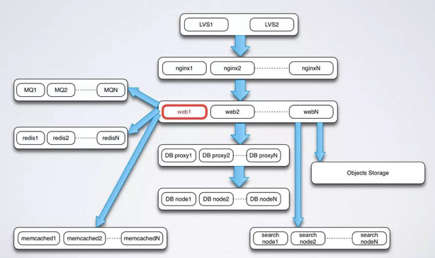
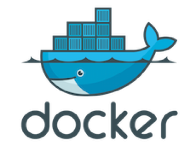
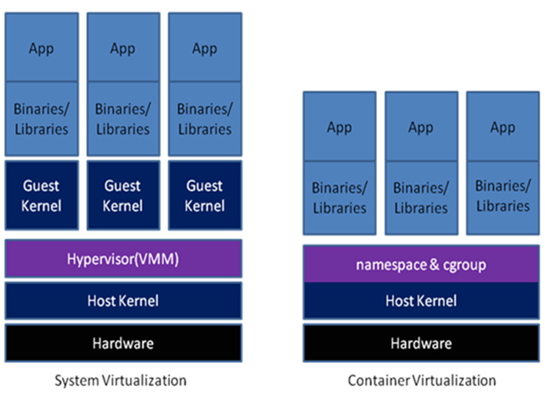
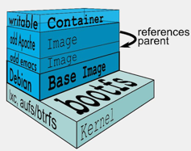
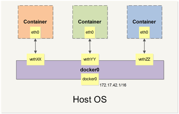
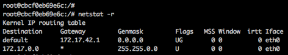
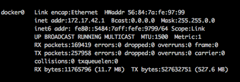
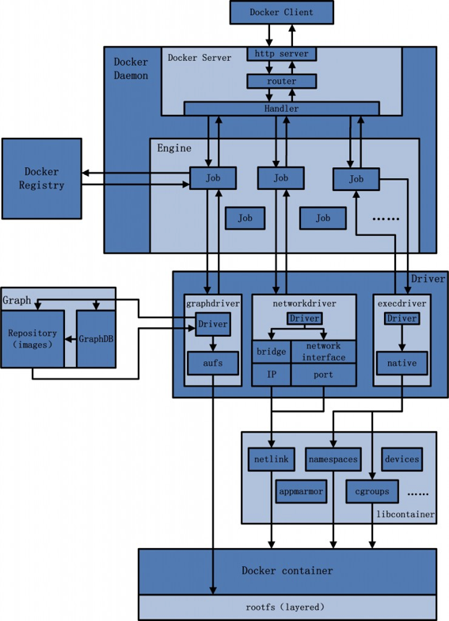
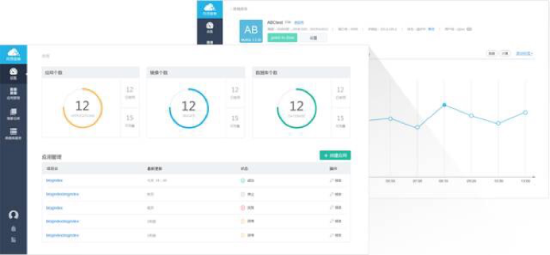

title: Docker全面介绍
categories: docker
tags: 
- docker
- 虚拟化
- 云计算
- 容器
date: 2015-12-10 00:00:00
---

### 云计算时代

伴随互联网浪潮和大数据时代的到来，在2006年8月9日，Google首席执行官埃里克·施密特在搜索引擎大会提出了“云计算”的概念。随后的几年时间，云计算成了最被追捧的概念，百度上“云计算”的搜索直攀高峰。可是却始终停留在概念上，人们都在好奇，云计算到底是怎样的技术。

随着亚马逊推出了aws，OpenStack等开源系统逐步完善，人们开始看清楚了云计算的技术模型，云计算开始越来越多的落到实地。公有云、私有云被越来越多的公司采用。

在我看来，云计算就是一种服务，以前人们完成软件开发周期，除了本身业务系统的开发，还需要开发或者部署各种依赖服务。而部署完成一套完整的软件，耗时耗力，还容易出现环境依赖的问题。云计算帮忙解放了运维。云计算提供的各种基础服务，让业务只需要关系本身的业务系统即可。可随着业务的扩大，只需要从云计算获取更多的对应资源即可。比如一个交易系统，它需要数据库服务，缓存服务，对象存储服务，搜索引擎服务，队列服务，负载均衡服务，离线分析系统，还需要很多服务器部署交易系统，系统间需要依赖网络通信。在没有云计算之前，业务方需要了解和部署如此多的基础服务，这些服务甚至远远比本身的交易系统复杂，小团队想完成这样一套系统，困难重重。可如今有了云计算，部署交易系统可以使用云主机，云网络帮你解决了网络连通性和安全性问题。云数据库服务、云缓存服务等帮你提供了服务支持，你只需要关系自身交易系统的开发，其他的都交给云计算就好。如此便捷的道路让很多人对云计算充满了期待。

复杂系统架构：

我列出的只是云计算IaaS层或者可以理解为部分PaaS层的服务。还有很多SaaS层的服务，像Google Doc，在线画图软件等等，它甚至让使用者只需要网络和浏览器就能完成以前必须安装庞大软件才能完成的工作。

这些只是我列出的云计算好处的小部分，云计算带来的好处是可以给互联网产业甚至很多传统产业带来翻天覆地变化的。

在上面我举例的交易系统只是列出了业务系统依赖基础服务完成快速的业务系统开发。而如今红极一时的Docker的出现，则让业务系统的部署进一步解放，带来了整个互联网产业运维方面的革命。

### Docker的意义

如果说个人主机时代大家比拼的关键技术是CPU主频的高低和内存的大小，那么云计算的时代，虚拟化技术无疑是整座信息技术大厦最核心的一块基石。

虚拟化技术既可以通过硬件模拟来实现，也可以通过操作系统实现，而近些年出现的容器虚拟化方案，更是充分利用了操作系统本身的机制和特性，可以实现轻量级虚拟化，甚至有人把它称为新一代虚拟化技术。Docker毫无疑问是其中的佼佼者。
Docker 是 PaaS 提供商 dotCloud 开源的一个基于 LXC 的高级容器引擎，源代码托管在 Github 上, 基于go语言并遵从Apache2.0协议开源。Docker自2013年开源以来，两年多的时间，涌入了成千上万的拥护者。Docker吸引了业界众多知名大牌厂家的支持，其中包括亚马逊（Amazon）、Canonical、CenturyLink、谷歌（Google）、IBM、 Microsoft、New Relic、Pivotal、Red Hat和VMware，这使得只要在有Linux的地方，Docker就几乎随处可用。

Docker为什么会这么火？它到底解决了什么问题呢？

Docker图标：

先来看看Docker的图标。一个大鲸鱼上面堆满了集装箱。为什么是集装箱，《集装箱改变世界》，里面洋洋洒洒20万字讲了一个20世纪全球运输业和世界经济被集装箱彻底颠覆的故事。

在没有集装箱之前，所有的货物都是码头工人一件一件放到货盘上，再把货盘降到船舱中一件一件搬下来堆好。耗时耗力，货物的处理费用占到了总支出的3层以上。而开始使用集装箱后，一个集装箱可以从打包好到船上，再到经过火车或卡车运输到厂家，都不需要卸货。同传统的货轮相比，集装箱船的装卸只需要大约1/6的时间和1/3的劳动力。

集装箱最大的成功在于其产品的标准化以及由此建立的一整套运输体系。无论货物的体积、形状差异有多大，最终都被装载进集装箱里。Docker提出的构建（build）、交付（ship）和运行（run）正如集装箱的思想，，从代码装进Docker，中间经过标准的Docker执行步骤而得以执行，这些步骤与环境无关，与操作系统的版本也无关。这带来的运维革命。

在没有Docker以前，一套系统的开发环境、测试环境、线上环境分开部署，配置不同。开发完成后开发把代码交给测试同事去测，测试同事拿到代码部署半天，开发介入后才发现是配置不对。上线的时候异常谨慎，生怕配置提交不对，部署步骤不一致。整个软件的生命周期拉的很长。而有了Docker以后，利用容器的话，那么开发直接在容器里开发，提测的时候把整个容器给测试，测好了把改动改在容器里再上线就好了。通过容器，整个开发、测试和生产环境可以保持高度的一致。这是Docker带来的最大好处，具体说来，Docker在开发和运维过程中，具有如下几个方面的优势。

1、资源独立、隔离

资源隔离是云计算平台的最基本需求。Docker通过linux namespace, cgroup限制了硬件资源与软件运行环境，与宿主机上的其他应用实现了隔离，做到了互不影响。不同应用或服务以”集装箱”（container）为单位装”船”或卸”船”，”集装箱船”（运行container的宿主机或集群 ）上，数千数万个”集装箱”排列整齐，不同公司、不同种类的”货物”（运行应用所需的程序，组件，运行环境，依赖）保持独立。

2、环境的一致性

开发工程师完成应用开发后build一个docker image，基于这个image创建的container像是一个集装箱，里面打包了各种”散件货物”（运行应用所需的程序，组件，运行环境，依赖）。无论这个集装箱在哪里：开发环境、测试环境、生产环境，都可以确保集装箱里面的“货物”种类与个数完全相同，软件包不会在测试环境缺失，环境变量不会在生产环境忘记配置，开发环境与生产环境不会因为安装了不同版本的依赖导致应用运行异常。这样的一致性得益于”发货”（build docker image）时已经密封到”集装箱”中，而每一个环节都是在运输这个完整的、不需要拆分合并的”集装箱”。

3、轻量化

相比传统的虚拟化技术（VM），使用Docker在CPU，Memory，Disk IO，Network IO上的性能损耗都有同样水平甚至更优的表现。Container的快速创建、启动、销毁受到很多赞誉。

4、Build Once, Run Everywhere

“货物”（应用）在”汽车”，”火车”，”轮船”（私有云、公有云等服务）之间迁移交换时，只需要迁移符合标准规格和装卸方式的”集装箱”（docker container），削减了耗时费力的人工”装卸”（上线、下线应用），带来的是巨大的时间人力成本节约。这使未来仅有少数几个运维人员运维超大规模装载线上应用的容器集群成本可能，如同60年代后少数几个机器操作员即可在几小时内连装带卸完一艘万级集装箱船。

### Docker虚拟化的优势

先介绍下云计算课上介绍的虚拟化技术：

* 1、虚拟化是一项对物理资源进行抽象化并使其显示为逻辑资源的技术。
* 2、虚拟化可在计算层、存储层、网络层和/或应用程序层实施。
 
虚拟化具有以下优势：

* 1、优化 IT基础架构的利用率。
* 2、降低成本和管理复杂性。
* 3、缩短部署时间。
* 4、提高灵活性。

从大类上分，虚拟化技术可分为基于硬件的虚拟化和基于软件的虚拟化。其中，真正意义上的基于硬件虚拟化技术不多见，少数如网卡中的单根多IO虚拟化等技术，超出了本文的讨论访问。

基于软件的虚拟化从对象所在的层次，又可以分为应用虚拟化和平台虚拟化。其中，前者一般指的是一些模拟设备或Wine这样的软件。后者又可以细分为如下几个子类：

* 1、 完全虚拟化。虚拟机模拟完整的底层硬件环境和特权指令的执行过程，客户操作系统无需进行修改。例如VMware Workstation、VirtualBox、QEMU等。
* 2、 硬件辅助虚拟化。利用硬件（主要是CPU）辅助支持（目前x86体系结构上可用的硬件辅助虚拟化技术包括Inter-VT和AMD-V）处理敏感指令来实现完全虚拟化的功能，客户操作系统无需修改，例如VMware Workstation、Xen、KVM。
* 3、 部分虚拟化。只针对部分硬件资源进行虚拟化，客户操作系统需要进行修改。现在有些虚拟化技术的早期版本仅支持部分虚拟化。
* 4、 超虚拟化。部分硬件接口以软件的形式提供给客户机操作系统，客户操作系统需要进行修改，例如早期的Xen。
* 5、 操作系统级虚拟化。内核通过创建多个虚拟的操作系统实例（内核和库）来隔离不同的进程。容器相关技术即在这个范畴。

Docker和传统虚拟机方式的不同之处：

Docker虚拟化方式之所以拥有众多优势。这跟操作系统的虚拟化自身的特点是分不开的。作为一种轻量级的虚拟化方式，Docker在运行应用上跟传统的虚拟机方式相比具有显著的优势：

* 1、 Docker容器很快，启动和停止可以在秒级实现，这相比传统的虚拟机方式要快得多。
* 2、 Docker容器对系统资源需求很少，一台主机可以同时运行数千个Docker容器。
* 3、 Docker通过类似Git的操作来方便用户获取、分发和更新应用镜像，指令简明，学习成本较低。
* 4、 Docker通过Dockerfile配置文件来支持灵活的自动化创建和部署自己，提高工作效率。

### Docker介绍

#### Docker核心概念

Docker有镜像（Image）、容器（Container）、仓库（Repository）三大核心概念，这三部分，组成了Docker的整个生命周期。

docker核心组件：

Docker镜像可以理解为面向Docker引擎的只读模板，包含了文件系统。Docker运行容器前，需要本地存在对应的镜像，如果镜像不存在，Docker就回去默认的镜像仓库下载。Docker集成了一系列镜像相关的重要命令操作，包括获取、查看、搜索、删除、创建等。

Docker容器类似于一个轻量级沙箱，Docker利用容器来运行和隔离应用。容器是从镜像创建的应用运行实例，可以将其启动、开始、停止、删除，而这些容器是相互隔离、互不可见的。简单说，容器是镜像的一个运行实例，所不同的是，它带有额外的可写文件层。

Docker仓库类似于代码仓库，是Docker集中存放镜像文件的场所。根据所存储的镜像公开分享与否，Docker仓库可以分为公开仓库（Public）和私有仓库（Private）两种形式。当用户创建了自己的镜像之后，就可以使用push命令将它上传到指定的公有或者私有仓库。这样用户下次在另一台机器上使用该镜像时，只需将其从仓库上pull下来就可以了。仓库概念的引入，为Docker镜像文件的分发和管理提供了便捷的途径。

#### 关于Dockerfile

Dockerfile是一个文本格式的配置文件，用户可以使用Dockerfile快速创建自定义的镜像。编写完成Dockerfile后，通过docker build命令即可创建镜像。
一般而言，Dockerfile分为四部分：基础镜像信息、维护者信息、镜像操作指令和容器启动时执行指令。

Dockerfile的关键字仅有：FROM、RUN、MAINTAINER、CMD、ENTRYPOINT、USER、EXPOSE、ENV、ADD、VOLUME、WORKDIR、ONBUILD、COPY这13个。使用也非常简单。

#### Docker数据管理

Docker管理数据主要有两种方式：数据卷（Data Volumes）和数据卷容器（Data Volumes Containers）

##### 数据卷

一个数据卷就是一个可供容器使用的特殊目录，它绕过文件系统，可以提供很多有用的特性：

* 1、 数据卷可以在容器之间共享和重用。
* 2、 对数据卷的修改会立马生效。
* 3、 对数据卷的更新，不会影响镜像。
* 4、 Volumes会一直存在，直到没有容器使用。

数据卷的使用，类似于Linux下对目录或文件进行mount操作。

##### 数据卷容器

如果用户需要在容器之间共享一些持续更新的数据，最简单的方式是使用数据卷容器，数据卷容器其实就是一个普通的Containers，专门用它提供数据卷供其他容器挂载。

使用数据卷容器可以让用户在容器之间自由地升级和移动数据卷。Docker提供了相应的命令，可以利用数据卷容器对其中的数据卷进行备份、恢复，以实现数据迁移。

#### Docker网络

Docker的网络功能相对简单，没有过多复杂的配置，Docker默认使用birdge桥接方式与容器通信，启动Docker后，宿主机上会产生docker0这样一个虚拟网络接口， docker0不是一个普通的网络接口， 它是一个虚拟的以太网桥，可以为绑定到docker0上面的网络接口自动转发数据包，这样可以使容器与宿主机之间相互通信。每次Docker创建一个容器，会产生一对虚拟接口，在宿主机上执行ifconfig，会发现多了一个类似veth****这样的网络接口，它会绑定到docker0上，由于所有容器都绑定到docker0上，容器之间也就可以通信。

Docker网络结构：

在宿主机上执行ifconfig，会看到docker0这个网络接口， 启动一个container，再次执行ifconfig, 会有一个类似veth****的interface，每个container的缺省路由是宿主机上docker0的ip，在container中执行netstat -r可以看到如下图所示内容：

容器中的默认网关跟docker0的地址是一样的：

当容器退出之后，veth*虚拟接口也会被销毁。

除bridge方式，Docker还支持host、container、none三种网络通信方式，使用其它通信方式，
只要在Docker启动时，指定--net参数即可，比如:

	docker run -i -t  --net=host ubuntu /bin/bash

host方式可以让容器无需创建自己的网络协议栈，而直接访问宿主机的网络接口，在容器中执行ip addr会发现与宿主机的网络配置是一样的，host方式让容器直接使用宿主机的网络接口，传输数据的效率会更加高效，避免bridge方式带来的额外开销，但是这种方式也可以让容器访问宿主机的D-bus等网络服务，可能会带来意想不到的安全问题，应谨慎使用host方式；container方式可以让容器共享一个已经存在容易的网络配置； none方式不会对容器的网络做任务配置，需要用户自己去定制。

### Docker实现分析

先来看下Docker的整体架构。Docker采用了标准的C/S结构，包括客户端和服务端两大部分。Docker底层依赖了Linux操作系统的容器技术，包括命名空间（Namespaces）、控制组（Control Groups）、联合文件系统（Union File Systems）和Linux虚拟化网络支持。
Docker架构：

#### 服务端

Docker daemon一直运行在宿主机后台，接受客户端请求，然后通过Engine模块分发管理来自客户端的任务。Docker服务端默认监听本地的unix:///var/run/docker.sock套接字，只允许本地root用户访问。

#### 客户端

Docker客户端为用户提供了一系列可执行命令。客户端发送命令后，等待服务端返回，一旦收到返回后，客户端即退出执行。客户端同样默认通过本地的unix:///var/run/docker.sock套接字向服务端发送命令。

#### 命名空间（Namespaces）

命名空间是Linux内核针对实现容器虚拟化而引入的强大特性。每个容器可以拥有自己的命名空间，运行在其中的应用都像是在独立的操作系统中运行一样。命名空间保证了容器之间彼此互不影响。

命名空间包括了：进程命名空间，网络命名空间，IPC命名空间，挂载命名空间，UTS命名空间，用户命名空间。通过这些空间的隔离，保证了容器间相互独立。

#### 控制组（Control Groups）

控制组是Linux内核的一个特性，主要用来对共享资源进行隔离、限制、审计等。只有能控制分配到容器的资源，Docker才能避免多个容器同时运行的系统资源竞争。

控制组可以提供对容器内存、CPU、磁盘IO等资源进行限制和计费管理，具体功能包括：资源限制（Resource Limiting）、优先级（Prioritization）、资源审计（Accounting）、隔离（Isolation）、控制（Control）。

#### 联合文件系统

联合文件系统是一种轻量级的高性能分层文件系统。它支持将文件系统中的修改信息作为一次提交，并层层叠加，同时可以将不同的目录挂载到同一个虚拟机文件系统下。

联合文件系统是实现Docker镜像的急速基础，镜像可以通过分层进行继承。

Docker中使用的AUFS（Another Union File System）就是一种联合文件系统。AUFS支持为每个成员目录设定只读、读写和写出权限。同时AUFS有一个类似分层的概念，对只读权限的分支可以逻辑上进行增量的修改。

### 关于Docker安全

Docker容器的安全性，很大程度上依赖Linux系统自身。Docker本身也做了很多防范。

首先Docker提供命名空间隔离。命名空间提供了最基础也是最直接的隔离，在容器中运行的进程不会被运行在本地主机上的进程和其他容器通过正常渠道发现和影响。

控制组是Linux容器机制的另一个关键组件，它可以确保各个容器可以公平地分享主机的内存、CPU、磁盘IO等资源。更重要的是，控制组确保了当发生在容器内的资源压力不会影响到本地主机系统和其他容器。

能力机制（Capability）是Linux内核一个强大的特征，可以提供细粒度的权限访问控制。通常在服务器上会运行一堆需要特权限制的进程，包括ssh、cron、syslogd、硬件管理工具模块、网络配置工具等。几乎所有的特权进程都有容器以外的支持系统来进行管理。大部分情况下，容器并不需要具备所有的能力，只需要少数能力即可。这样就算攻击者在容器中取得了root权限，也不能获得本地主机较高权限，能进行的破坏也有限。

Docker服务端的运行目前还需要root权限的支持，Docker服务端安全性也是十分重要的。Docker服务端的安全更多需要使用者注意，必须确保可信的用户才能访问到Docker服务。

由上述所述，Docker的安全问题本质上就是容器技术的安全性问题，这包括共用内核问题，Namespace还不够完善的限制以及Docker运行在root权限所致。Docker也在致力于安全方面的改进，用户在使用Docker也需要防范这些安全性问题。

### Docker在网易的实践
2015.10.09 网易上线了网易蜂巢，蜂巢是采用Docker容器化技术的云计算平台，既有应用引擎带来的简单高效（构建、部署和运维功能），同时又有云计算IaaS服务的灵活性，全部采用SSD存储，给用户极速体验。

网易蜂巢：

蜂巢底层依赖网易成熟的IaaS技术。IaaS层基于开源的Openstack二次开发，已经覆盖了网易大部分应用。同时把Docker部署在IaaS层的云主机，提高了服务的安全性。IaaS层上提供了NLB（网易负载均衡服务）、NBS（网易云硬盘服务）、CNS（云网络服务）、RDS（关系数据库服务）等基础服务，以租户（tenant）为单位，使用kubernetes管理Docker集群，搭建CaaS服务。

蜂巢架构：

参考文献：

* [1]陈全，邓倩妮.云计算及其关键技术.《计算机应用》, 2009, 第9期(9):2562-2567
* [2]张建勋，古志民，郑超.云计算研究进展综述.《计算机应用研究》, 2010, 27(2):429-433
* [3]汪恺，张功萱，周秀敏.基于容器虚拟化技术研究.《计算机技术与发展》, 2015, 08期(8):138-141
* [4]杨保华，戴王剑，曹亚仑.Docker技术入门与实战.机械工业, 2015
* [5]陈清金，陈存香，张岩.Docker技术实现分析.《信息通信技术》, 2015, 02期(2):37-40
* [6]孙宏亮.Docker源码分析（一）：Docker架构.http://www.infoq.com/cn/articles/docker-source-code-analysis-part1/
* [7]xzs.Docker系列之一：入门介绍.http://tech.meituan.com/docker_introduction.html
* [8]金灵杰.存储在容器中是如何工作的.http://www.infoq.com/cn/news/2015/10/user-space
* [9]editor006.从Docker容器漏洞谈Docker安全.http://www.d1net.com/security/news/270982.html
* [10]Gary的影响力.为什么容器技术将改变互联网世界？从《集装箱改变世界》谈起.http://chuansong.me/n/1887312
* [11]http://docs.docker.com/
* [12]孙健波.Docker背后的内核知识——Namespace资源隔离.http://www.infoq.com/cn/articles/docker-kernel-knowledge-namespace-resource-isolation
* [13]fber.浅谈Docker隔离性和安全性.http://www.freebuf.com/articles/system/69809.html
* [14]网易蜂巢.https://c.163.com/
