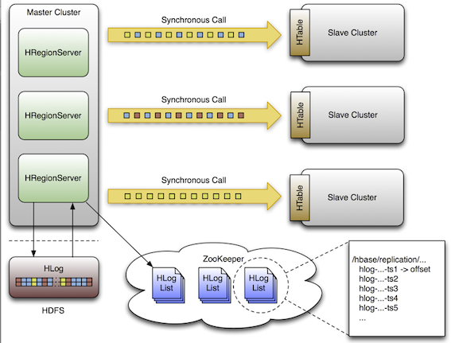
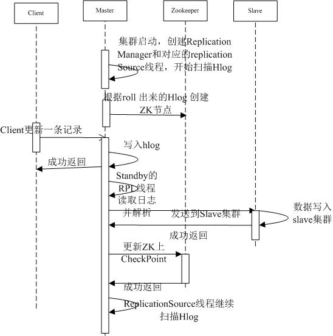
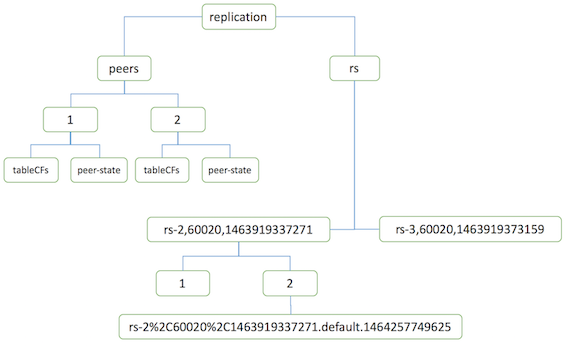
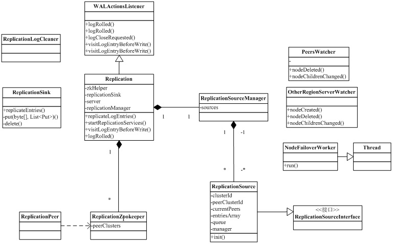

title: HBase复制详解
tags:
  - HBase
  - Hadoop
  - replication
  - 分布式
categories: HBase
date: 2016-05-27 00:00:00
---

## 前言

最近公司需要完成HBase线上跨机房的数据迁移，于是开始调研HBase的迁移方案。经过大量的查阅资料，最终把方案定格在了CopyTable+Replication上，跟业界一些HBase的大牛了解到，这也是业界的常用做法。CopyTable的原理很简单，利用MR任务，并行scan从源表获取数据，然后写到新表，完成全量复制。而关于复制，翻看一些资料，虽然有些使用HBase的版本会老一些，不过都提及到了，HBase的复制还是实验性项目。复制本来是用来做HBase集群的高可用的，而了解了业界的一些HBase的应用，基本都没在线上集群开启复制，复制功能大都是在迁移HBase数据的时候才用上。既然复制还没广泛应用，线上复制会出什么问题都不可知晓，把复制功能作为黑盒使用，难免会有风险。于是对HBase的复制技术进行了详细的了解。[《HBase官方文档》](http://hbase.apache.org/book.html#_cluster_replication)和[《HBase Replication 介绍》](http://blog.csdn.net/teriy/article/details/7954203)对复制技术做了比较详细的解释，不过对于复制的细节，还需要从源码中寻找。复制相关的命令如何实现的，会对现有集群产生什么影响？复制相关的监控参数有哪些？zk上复制相关的结构是如何的？增量数据写入过快会对HBase产生怎样的影响？regionserver宕机会对复制产生怎样的影响？...

由于公司使用的HBase使用的1.0.0版本，文章中所有的复制技术都是以该版本为准。其他版本的HBase会在一些元数据名称和结构上有些调整，不过复制实现基本是差不多的。

## 复制原理

HBase使用异步复制，所以Master上的写入数据，并不能保证马上就在Slave上读取到。HBase复制是使用Master推送的方式实现的，所有配置相关的参数都在Master这边配置，Slave只要复制参数开启即可。

说到HBase的复制架构，都会引用官方的这张图。因为有了HLog，所以复制功能实现起来原理比较简单。HBase使用WAL机制，写入的数据都先写在HLog，Master有个复制线程，会定时检查HLog是否有数据更新，如果有数据更新就会把更新的数据发送给Slave。复制CheckPoint的位置会记录在zk上，等Slave更新数据完成后，Master才会在zk上更新最新的CheckPoint。这样复制出现异常时，恢复后能恢复到之前复制的位置。《HBase Replication 介绍》里的这张图很清晰的描述了复制的整个流程。

Master集群启动的时候，每个regionserver会针对一个Slave集群创建一个ReplicationSource线程，ReplicationSource线程定时扫描HLog，扫描的时候会读取到新写入的HLog，把这些HLog发送个Slave后，ReplicationSource线程会更新zk的CheckPoint，这样这部分数据的复制就完成了。

复制的原理和流程看起来还是比较简单的，不过这些还回答不了前言中抛出的种种问题，接下来我就把我所了解的复制的细节一一描述。

## 复制相关命令及其实现

通过help命令可以看到，复制包含了如下命令：

	Group name: replication
	Commands: add_peer, append_peer_tableCFs, disable_peer, enable_peer, list_peers, list_replicated_tables, remove_peer, remove_peer_tableCFs, set_peer_tableCFs, show_peer_tableCFs

* add_peer <ID> <CLUSTER_KEY> : 添加一条复制连接，ID是连接的标识符，CLUSTER_KEY的格式是:HBase.zookeeper.quorum:HBase.zookeeper.property.clientPort:zookeeper.znode.parent。
* list_peers : 查看所有的复制连接
* enable_peer <ID> : 设置某条复制连接为可用状态，add_peer一条连接默认就是enable的，通过disable_peer命令让该连接变为不可用的时候，可以通过enable_peer让连接变成可用。
* disable_peer <ID> : 设置某条复制连接为不可用状态。
* remove_peer <ID> : 删除某条复制连接
* set_peer_tableCFs <ID> <TABLE_NAME> : 设置某条复制连接可以复制的表信息。默认add_peer添加的复制连接是可以复制集群所有的表，如果只想复制某些表的话，就可以用set_peer_tableCFs，复制连接的粒度可以到表的列族，表之间通过';'隔开，列族之间通过','隔开，e.g：set_peer_tableCFs '2', "table1; table2:cf1,cf2; table3:cfA,cfB"。使用'set_peer_tableCFs <ID>'命令设置复制连接复制所有的表
* append_peer_tableCFs <ID> <TABLE_NAME> : 可以为复制连接添加需要复制的表。
* remove_peer_tableCFs <ID> <TABLE_NAME> : 为复制连接删除不需要复制的表。
* show_peer_tableCFs <ID> : 查看某条复制连接复制的表信息，查出的信息为空时，表示复制所有的表。
* list_replicated_tables : 列出所有复制的表。

上面列出了所有的复制命令，除了复制的命令，对于一张表是否能够复制，还需要更改表的相关属性。也就是说add_peer了一条复制连接，并不能复制集群的表数据，只有开启了复制开关的表，才能进行复制。HBase表的复制属性是`REPLICATION_SCOPE`，粒度到列族。所以HBase是可以只复制表的某些列族而不用复制整张表的。`REPLICATION_SCOPE`默认为0，表示local模式，设置列族开启复制的话，需要把`REPLICATION_SCOPE`设置为1，即golbal模式。

说到REPLICATION_SCOPE参数，就得提前我犯的一个错误，这个错误竟然还把测试环境的HBase集群搞挂了，而且再也拿不起来了，对我造成了相当大的恐慌，要是这是线上集群就完蛋了，也让我怀疑起HBase的复制，以及加重了我了解HBase复制细节的决心。我查看的所有HBase复制文章里面给出的demo基本都是:

	add_peer '1' 'zk_addr'
	create 'table', {NAME=>"cf", REPLICATION_SCOPE=>"1"}

于是乎，我想当然的以为这两个'1'是有关联的，我以为REPLICATION_SCOPE配置的是add_peer的id。后面我测试其他复制连接的时候，由于peer id是3，所以我把REPLICATION_SCOPE也设置为3，HBase并没有禁止这种行为，不过在HLog中记录的REPLICATION_SCOPE就出了问题，导致日志一直报NullPointerException的错误。只是报错还好，中间我把regionserver重启了下，结果在启动的时候，LogRoller也触发到了NullPointerException的异常，由于LogRoller认为所有异常都是致命的，所以会Abort，导致regionserver退出。之前没明白为什么regionserver一直无法拉起，然后我利用regionserver起来还能存活几秒钟，把所有的复制属性去掉(后面明白，主要是REPLICATION_SCOPE修改需要有regionserver在线)，regionserver终于不再Abort了。后面看了HBase的源码才明白，REPLICATION_SCOPE只能设置为0和1，1表示表可以开启复制，至于复制相关的配置都由peer相关的命令控制的。也明白了regionserver宕机，以及去掉REPLICATION_SCOPE属性，恢复的原因了。

接下来看一下复制相关命令是如何实现的。HBase命令通过shell执行是利用jruby直接执行了HBase-client里的方法，org.apache.hadoop.HBase.client.replication.ReplicationAdmin实现了所有的命令，查看具体命令实现，会发现，所有的命令都是基于对zk目录结构的操作，增加一个复制连接，就是在zk上增加一个连接目录。服务端会watch复制目录下的变化，有新节点加了与删除会做出对应的修改。所以所有跟复制相关的命令都不依赖于HBase集群的上下线。

## 复制示例

假设有Master、Slave两个集群，均开启了复制功能。
在Master上执行如下命令:

	add_peer "1", "hdp01,hdp02,hdp03:2181:/HBase"
	create 'test', {NAME=>"cf", REPLICATION_SCOPE=>"1"}
	
针对已经创建了test表，则alter相关的列族

	disable 'test'
	alter 'test' , {NAME=>"cf", REPLICATION_SCOPE=>"1"}
	enable 'test'	

在Slave上也需要创建相应的表 :

	create 'test', {NAME=>"cf"}
	
这样就建立了test:cf的复制关系，对Master的test表的写入，都会同步到Slave上。如果执行：

	disable_peer '1'

再在Master上对test表写入，Slave就不会看到对应的数据。然后执行：

	enable_peer '1'

Slave上就得到了对应的数据。

## zookeeper上复制相关的znode结构

下面看一下zk上复制相关的znode，知道了znode结构，也就掌握了复制的元数据信息。

复制相关的znode都在HBase目录的replication目录下。主要分成两个目录：

* peers : 记录了全部的复制连接。每个复制连接下面还有tableCFs和peer-state两个znode，tableCFs记录复制的表信息，peer-state记录复制连接是enable还是disable。
* rs : 管理了全部的regionserver复制信息。rs目录下包含了每个regionserver的名称，每个regionserver里面记录了该regionserver使用的全部复制连接。每个复制连接里面记录了当前hlog队列和每个hlog对应的CheckPoint。

这就是复制在zk上的完整结构。regionserver和master就根据这份数据进行处理。之前不了解zk结构，可能担心disable复制连接的时候，增量数据会不会让zk压力过大。了解了zk结构后，在不断写入增量数据的时候，rs目录下的hlog数量会不停增多，对zk的写入压力倒是有限，不过后面说到的故障处理，过多的hlog，在故障处理会给zk带来不小压力。

## 复制时增量数据的处理方式

如果HLog里所有记录对应的数据都已经刷新到HFile上，HLog就被RegionServer移动到oldWALs目录下。正常情况下，HMaster上的定时清理任务LogCleaner就会把oldWALs下的HLog文件全部清掉。在开启复制功能的时候，如果HLog的数据没有传递给Slave，即使已经刷到HFile上，HMaster不会把这些数据清理掉。

HMaster怎么判断HLog的数据是否传递给Slave了呢？这个就得借助我们之前说的zk了。zk在rs/region_id/peer_id目录下会保存所有没复制到Slave的HLog文件名称。HMaster在清除oldWALs目录下的HLog的时候会想判断rs/region_id/peer_id目录HLog文件是否存在，如果存在的话，就不清理该HLog，这样，这些还没复制给Slave的HLog就保留下来了。

为了导入全量数据，Master都会先暂时disable复制连接。这时候增量数据会不断累积，所以有些问题需要注意下。

如果增量数据写入速度过快的话，oldWALs目录下HLog会增加的很快，这些HLog的数据由于没复制到Slave，所以一直会在HDFS上保留，所以需要注意HDFS的空间以及oldWALs目录的quota,超过quota会引起regionserver的宕机，以及HBase不能写入的问题。

如果开启了多个复制连接，在某个复制连接出现问题的时候（对端Slave离线，或者复制连接被disable），HLog不仅仅会积压该复制连接的数据，在zk记录的异常复制连接CheckPoint之后的全部HLog都会被遗留下来(即使新增的HLog跟异常复制连接没有任何关系)，造成HLog的堆积。HBase并没有那么聪明的区分不同的复制连接的数据。

## 故障处理(failover)

在复制过程中，如果Slave的regionserver异常离线，这种情况处理比较简单，Master只需要选择另外一个Slave的regionserver完成复制即可。如果Master的regionserver离线，情况要复杂一些。

Master集群某个regionserver离线后，其他regionserver会检测到这种情况，从而接管该regionserver负责的region，其中关于复制这块是这样处理的。

	/HBase/replication/rs/
    1.1.1.1,60020,123456780/
      2/
        1.1.1.1,60020.1234  (Contains a position)
        1.1.1.1,60020.1265
    1.1.1.2,60020,123456790/
      2/
        1.1.1.2,60020.1214  (Contains a position)
        1.1.1.2,60020.1248
        1.1.1.2,60020.1312
    1.1.1.3,60020,    123456630/
      2/
        1.1.1.3,60020.1280  (Contains a position)

所有的文章都以官方文档的该图为例。正常时3个regionserver负责复制数据。zk上的目录结构是图中所示。如果rs2离线后，其他regionserver会负责竞争rs2负责的HLog的复制权，如下图所示，rs3获得了rs2的复制权，rs3会把rs2的复制配置拷贝一份到自己的目录下，标记为2-rs2，表示是恢复rs2没完成的复制数据。

  	/HBase/replication/rs/
    1.1.1.1,60020,123456780/
      2/
        1.1.1.1,60020.1234  (Contains a position)
        1.1.1.1,60020.1265
    1.1.1.2,60020,123456790/
      lock
      2/
        1.1.1.2,60020.1214  (Contains a position)
        1.1.1.2,60020.1248
        1.1.1.2,60020.1312
    1.1.1.3,60020,123456630/
      2/
        1.1.1.3,60020.1280  (Contains a position)

      2-1.1.1.2,60020,123456790/
        1.1.1.2,60020.1214  (Contains a position)
        1.1.1.2,60020.1248
        1.1.1.2,60020.1312

如果在恢复的zk结构已经形成，即使这期间，rs2异常恢复了。其离线前所负责的HLog也还是交由rs3负责。

如果此时rs3又异常离线了，rs1会接管rs3的复制任务，同时rs3上中还有的rs2没完成的复制任务也会被复制到rs1中。

  	/HBase/replication/rs/
    1.1.1.1,60020,123456780/
      2/
        1.1.1.1,60020.1378  (Contains a position)

      2-1.1.1.3,60020,123456630/
        1.1.1.3,60020.1325  (Contains a position)
        1.1.1.3,60020.1401

      2-1.1.1.2,60020,123456790-1.1.1.3,60020,123456630/
        1.1.1.2,60020.1312  (Contains a position)
    1.1.1.3,60020,123456630/
      lock
      2/
        1.1.1.3,60020.1325  (Contains a position)
        1.1.1.3,60020.1401

      2-1.1.1.2,60020,123456790/
        1.1.1.2,60020.1312  (Contains a position)

## 复制进度监控

复制过程中，如果我们想了解负责的进度，可以通过HBase的复制监控的相关参数和命令获取。`status 'replication'`可以查看当前的复制情况。

    HBase(main):001:0> status 'replication'
    version 1.0.0
    3 live servers
        regionserver-2:
           SOURCE: PeerID=1, AgeOfLastShippedOp=0, SizeOfLogQueue=0, TimeStampsOfLastShippedOp=Thu May 26 15:51:40 CST 2016, Replication Lag=0 PeerID=2, AgeOfLastShippedOp=0, SizeOfLogQueue=0, TimeStampsOfLastShippedOp=Thu May 26 15:51:40 CST 2016, Replication Lag=0
           SINK  : AgeOfLastAppliedOp=0, TimeStampsOfLastAppliedOp=Sun May 22 20:15:43 CST 2016
        regionserver-4:
           SOURCE: PeerID=1, AgeOfLastShippedOp=0, SizeOfLogQueue=0, TimeStampsOfLastShippedOp=Thu May 26 15:51:41 CST 2016, Replication Lag=0 PeerID=2, AgeOfLastShippedOp=0, SizeOfLogQueue=0, TimeStampsOfLastShippedOp=Thu May 26 15:51:41 CST 2016, Replication Lag=0
           SINK  : AgeOfLastAppliedOp=0, TimeStampsOfLastAppliedOp=Wed May 25 20:13:56 CST 2016
        regionserver-3:
           SOURCE: PeerID=1, AgeOfLastShippedOp=0, SizeOfLogQueue=0, TimeStampsOfLastShippedOp=Thu May 26 15:51:40 CST 2016, Replication Lag=0 PeerID=2, AgeOfLastShippedOp=0, SizeOfLogQueue=0, TimeStampsOfLastShippedOp=Thu May 26 15:51:40 CST 2016, Replication Lag=0
           SINK  : AgeOfLastAppliedOp=0, TimeStampsOfLastAppliedOp=Sun May 22 20:16:15 CST 2016

示例中，有三台regionserver，每台regionserver有SOURCE和SINK两份参数，SOURCE是复制的源端，相当于Master的监控数据，SINK是目的端，相当于Slave的监控数据。Master只看SOURCE，Slave只看SINK。相关的参数说明如下：

* PeerID : 复制连接id
* AgeOfLastShippedOp :上一次复制数据给Slave的延迟时间
* SizeOfLogQueue : 还没有完成复制的HLog数量
* TimeStampsOfLastShippedOp : 上一次复制数据给Slave的时间
* Replication Lag : 复制延迟时间

除了`status 'replication'`命令，在Metrics监控里面还有更详细的复制统计数据。下面是一份Metrics里的复制统计数据。

	{
	    "name" : "Hadoop:service=HBase,name=RegionServer,sub=Replication",
	    "modelerType" : "RegionServer,sub=Replication",
	    "tag.Context" : "regionserver",
	    "tag.Hostname" : "regionserver-2",
	    "source.1.logEditsRead" : 457239,
	    "source.1.logReadInBytes" : 212179411,
	    "source.2.shippedOps" : 11726,
	    "source.2.logEditsRead" : 315487,
	    "source.1.shippedKBs" : 94549,
	    "source.ageOfLastShippedOp" : 0,
	    "source.shippedKBs" : 101367,
	    "source.logReadInBytes" : 359568890,
	    "source.1.sizeOfLogQueue" : 0,
	    "source.2.logReadInBytes" : 147389479,
	    "source.sizeOfLogQueue" : 0,
	    "source.2.sizeOfLogQueue" : 0,
	    "sink.ageOfLastAppliedOp" : 0,
	    "source.logEditsRead" : 772726,
	    "source.1.ageOfLastShippedOp" : 0,
	    "source.shippedOps" : 181258,
	    "source.2.logEditsFiltered" : 303761,
	    "source.logEditsFiltered" : 591468,
	    "source.2.ageOfLastShippedOp" : 0,
	    "sink.appliedOps" : 0,
	    "source.1.shippedOps" : 169532,
	    "source.2.shippedBatches" : 316,
	    "source.2.shippedKBs" : 6818,
	    "source.1.logEditsFiltered" : 287707,
	    "source.shippedBatches" : 12459,
	    "source.1.shippedBatches" : 12143,
	    "sink.appliedBatches" : 0
	}    
    
Metrics记录的监控数据分为MetricsSink、singleSourceSource和globalSourceSource，MetricsSink记录了目的端的监控数据，singleSourceSource记录了一条复制连接的统计数据，globalSourceSource是把所有的统计数据汇总。这些统计数据包含：

源端：

* sizeOfLogQueue ： 还有多少wal文件没处理
* ageOfLastShippedOp ： 上一次复制延迟时间
* shippedBatches : 传输了多少批数据
* shippedKBs ：传输了多少KB的数据
* shippedOps ：传输了多少条数据
* logEditsRead ： 读取了多少个logEdits
* logReadInBytes ：读取了多少KB数据
* logEditsFiltered : 实际过滤了多少logEdits

目的端：

* sink.ageOfLastAppliedOp ： 上次处理的延迟
* sink.appliedBatches ： 处理的批次数
* sink.appliedOps ： 处理的数据条数

## 复制相关配置

* zookeeper.znode.replication : znode复制相关的目录，默认为`replication`
* zookeeper.znode.replication.peers : znode复制peers相关的目录，默认为`peers`
* zookeeper.znode.replication.peers.state : znode复制state相关的目录，默认为`peer-state`
* zookeeper.znode.replication.rs : znode复制rs相关的目录，默认为`rs`
* HBase.replication : HBase复制的开关，默认为`false`，设置为true才能开启复制功能。
* replication.sleep.before.failover : 发现有rs离线后，sleep多长时间才开始failover，默认为`30000`，单位是ms，即30s。
* replication.executor.workers : rs执行failover使用的线程数，默认是`1`
* replication.source.nb.capacity : 一次最多复制多少条数据，默认为`25000`
* replication.source.size.capacity : 一次最多复制多大的数据，默认为`1024*1024*64`，即64MB。
* replication.source.ratio : 主集群里使用Slave服务器的百分比，默认是`0.1f`

## 复制源码结构

replication实现相关的代码主要在HBase-client和HBase-server，代码并不多。HBase-client主要操作是在复制命令的相关实现，HBase-server则实现了复制的细节。《HBase Replication 介绍》里的replication class图非常清晰的描述了复制使用的class。

HBase-client主要类:

* org.apache.hadoop.HBase.client.replication.ReplicationAdmin : 复制相关命令的实现
* org.apache.hadoop.HBase.replication.ReplicationPeer : 操作zk的peers目录
* org.apache.hadoop.HBase.replication.ReplicationQueues : 操作zk的rs目录
* org.apache.hadoop.HBase.replication.ReplicationTracker : 监控其他regionsever信息

HBase-server主要类:

* org.apache.hadoop.HBase.replication.master.ReplicationLogCleaner : HMaster清理复制日志的实现
* org.apache.hadoop.HBase.replication.regionserver.Replication : regionserver复制功能对外的接口类
* org.apache.hadoop.HBase.replication.regionserver.ReplicationSourceManager : regionserver复制功能源端的复制连接管理类，负责初始化，启动或结束线程，同时也会watch主集群的ZK上RS节点在有RS退出或加入是时立即failover，保证数据的无丢失。内部类NodeFailoverWorker负责处理故障转移
* org.apache.hadoop.HBase.replication.regionserver.ReplicationSource : 源端复制连接的具体操作，负责读取，解析，发送和记录HLog
* org.apache.hadoop.HBase.replication.regionserver.MetricsSource : 源端复制连接的监控数据
* org.apache.hadoop.HBase.replication.regionserver.ReplicationSinkManager : regionserver复制功能目的端的管理类
* org.apache.hadoop.HBase.replication.regionserver.ReplicationSink : 目的端复制连接的具体操作，接收主集群的hlog entry后，分析并写入本集群
* org.apache.hadoop.HBase.replication.regionserver.MetricsSink : 目的端复制连接的监控数据

参考文章：

* [《HBase官方文档》](http://hbase.apache.org/book.html#_cluster_replication)
* [《HBase Replication 介绍》](http://blog.csdn.net/teriy/article/details/7954203)
* [《HBase高可用原理与实践》](http://www.bitstech.net/2015/12/21/HBase_replication/)