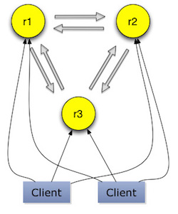
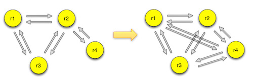
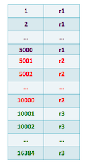
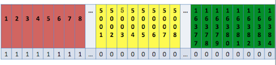
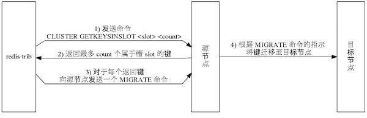

title:      redis3.0 cluster功能介绍
categories: redis
tags: 
- redis
- cluster
- 分布式
date: 2015-12-30 00:00:00

---

redis从3.0开始支持集群功能。redis集群采用无中心节点方式实现，无需proxy代理，客户端直接与redis集群的每个节点连接，根据同样的hash算法计算出key对应的slot，然后直接在slot对应的redis上执行命令。在redis看来，响应时间是最苛刻的条件，增加一层带来的开销是redis不原因接受的。因此，redis实现了客户端对节点的直接访问，为了去中心化，节点之间通过gossip协议交换互相的状态，以及探测新加入的节点信息。redis集群支持动态加入节点，动态迁移slot，以及自动故障转移。

### 集群架构

每个节点都会跟其他节点保持连接，用来交换彼此的信息。节点组成集群的方式使用`cluster meet`命令，meet命令可以让两个节点相互握手，然后通过gossip协议交换信息。如果一个节点r1在集群中，新节点r2加入的时候与r1节点握手，r1节点会把集群内的其他节点信息通过gossip协议发送给r2，r2会一一与这些节点完成握手，从而加入到集群中。

节点在启动的时候会生成一个全局的标识符，并持久化到配置文件，在节点与其他节点握手后，这些信息也都持久化下来。节点与其他节点通信，标识符是它唯一的标识，而不是IP、PORT地址。如果一个节点移动位置导致IP、PORT地址发生变更，集群内的其他节点能把该节点的IP、PORT地址纠正过来。

### 集群数据分布

集群数据以数据分布表的方式保存在各个slot上。默认的数据分布表默认含有16384个slot。

key与slot映射使用的CRC16算法，即：slot = CRC16(key) mod 16384。

集群只有在16384个slot都有对应的节点才能正常工作。slot可以动态的分配、删除和迁移。
每个节点会保存一份数据分布表，节点会将自己的slot信息发送给其他节点，发送的方式使用一个unsigned char的数组，数组长度为16384/8。每个bit标识为0或者1来标识某个slot是否是它负责的。

使用这样的方式传输，就能大大减少数据分布表的字节。这种方式使用的字节为2048，如果纯粹的传递数据分布表，那边一个slot至少需要2字节的slot值+2字节port+4字节ip，共8 * 16384=131072字节，或者以ip、port为键，把节点对应的slot放在后面，那么也至少需要2 * 16384加上节点的数量，也远远大于2048字节。由于节点间不停的在传递数据分布表，所以为了节省带宽，redis选择了只传递自己的分布数据。但这样的方式也会带来管理方面的麻烦，如果一个节点删除了自己负责的某个slot，这样该节点传递给其他节点数据分布表的slot标识为0，而redis采用了`bitmapTestBit`方法，只处理slot为1的节点，而并未把每个slot与收到的数据分布表对比，从而产生了节点间数据分布表视图的不一致。这种问题目前只能通过使用者来避免。

redis目前还支持slot的迁移，可以把一个slot从一个节点迁移到另一个节点，节点上的数据需要使用者通过`cluster getkeysinslot`去除迁移slot上的key，然后执行`migrate`命令一个个迁移到新节点。具体细节会在下面的`slot迁移`章节介绍。

### 集群访问

客户端在初始化的时候只需要知道一个节点的地址即可，客户端会先尝试向这个节点执行命令，比如“get key”，如果key所在的slot刚好在该节点上，则能够直接执行成功。如果slot不在该节点，则节点会返回MOVED错误，同时把该slot对应的节点告诉客户端。客户端可以去该节点执行命令。目前客户端有两种做法获取数据分布表，一种就是客户端每次根据返回的MOVED信息缓存一个slot对应的节点，但是这种做法在初期会经常造成访问两次集群。还有一种做法是在节点返回MOVED信息后，通过`cluster nodes`命令获取整个数据分布表，这样就能每次请求到正确的节点，一旦数据分布表发生变化，请求到错误的节点，返回MOVED信息后，重新执行`cluster nodes`命令更新数据分布表。

在访问集群的时候，节点可能会返回ASK错误。这种错误是在key对应的slot正在进行数据迁移时产生的，这时候向slot的原节点访问，如果key在迁移源节点上，则该次命令能直接执行。如果key不在迁移源节点上，则会返回ASK错误，描述信息会附上迁移目的节点的地址。客户端这时候要先向迁移目的节点发送ASKING命令，然后执行之前的命令。

这些细节一般都会被客户端sdk封装起来，使用者完全感受不到访问的是集群还是单节点。

集群支持hash tags功能，即可以把一类key定位到同一个节点，tag的标识目前支持配置，只能使用`{}`，redis处理hash tag的逻辑也很简单，redis只计算从第一次出现`{`，到第一次出现`}`的substring的hash值，substring为空，则仍然计算整个key的值，这样对于foo{}{bar}、{foo}{bar}、foo{{bar}}这些冲突的`{}`，也能取出tag值。使用者需遵循redis的hash tag规范。

	127.0.0.1:6379> CLUSTER KEYSLOT foo{hash_tag}
	(integer) 2515
	127.0.0.1:6379> CLUSTER KEYSLOT fooadfasdf{hash_tag}
	(integer) 2515
	127.0.0.1:6379> CLUSTER KEYSLOT fooadfasdfasdfadfasdf{hash_tag}
	(integer) 2515

集群版本的redis能够支持全部的单机版命令。不过还是有些命令会有些限制。

订阅在使用上与单机版没有任何区别。订阅功能通过集群间共享publish消息实现的，客户端可以向任意一个节点（包括slave节点）订阅消息，然后在一个节点上执行的publish命令，该节点会把该命令传播给集群内的每个节点，这样订阅该消息的客户端就能收到该命令。

redis集群版只使用db0，select命令虽然能够支持select 0。其他的db都会返回错误。

	127.0.0.1:6379> select 0
	OK
	127.0.0.1:6379> select 1
	(error) ERR SELECT is not allowed in cluster mode

redis集群版对多key命令的支持，只能支持多key都在同一个slot上，即使多个slot在一个节点上也不行。

	127.0.0.1:6379> mget key7 key28
	(error) CROSSSLOT Keys in request don't hash to the same slot

事务的支持只能在也一个slot上完成。`MULTI`命令之后的命令的key必须都在同一个slot上，如果某条命令的key对应不在相同的slot上，则事务直接回滚。迁移的时候，在迁移源节点执行命令的key必须在移原节点上存在，否则事务就会回滚。在迁移目的节点执行的时候需要先执行`ASKING`命令再执行`MULTI`命令，这样接下来该slot的命令都能被执行。可以看出，对于单key和相同hash tags的事务，集群还是能很好的支持。

在迁移的时候有个地方需要注意，对于多key命令在迁移目的节点执行时，如果多个key全在该节点上，则命令无法执行。如下所示，key和key14939对应的slot为12539，执行命令的节点是迁移目的节点：

	127.0.0.1:6379> asking
	OK
	127.0.0.1:6379> mget key key14939
	(error) TRYAGAIN Multiple keys request during rehashing of slot

### 集群消息

集群间互相发送消息，使用另外的端口，所有的消息在该端口上完成，可以成为消息总线，这样可以做到不影响客户端访问redis，可见redis对于性能的追求。目前集群有如下几种消息：

*	CLUSTERMSG_TYPE_PING：gossip协议的ping消息。
*	CLUSTERMSG_TYPE_PONG：gossip协议的pong消息。
*	CLUSTERMSG_TYPE_MEET：握手消息。
*	CLUSTERMSG_TYPE_FAIL：master节点检测到，超过半数master认为某master离线，则发送fail消息。
*	CLUSTERMSG_TYPE_PUBLISH：publish消息，向其他节点推送消息。
*	CLUSTERMSG_TYPE_FAILOVER_AUTH_REQUEST：故障转移时，slave发送向其他master投票请求。
*	CLUSTERMSG_TYPE_FAILOVER_AUTH_ACK：故障转移时，其他master回应slave的请求。
*	CLUSTERMSG_TYPE_UPDATE：通知某节点，它负责的某些slot被另一个节点替换。
*	CLUSTERMSG_TYPE_MFSTART：手动故障转移时，slave请求master停止访问，从而对比两者的数据偏移量，可以达到一致。

集群节点间相互通信使用了gossip协议的push/pull方式，ping和pong消息，节点会把自己的详细信息和已经和自己完成握手的3个节点地址发送给对方，详细信息包括消息类型，集群当前的epoch，节点自己的epoch，节点复制偏移量，节点名称，节点数据分布表，节点master的名称，节点地址，节点flag为，节点所处的集群状态。节点根据自己的epoch和对方的epoch来决定哪些数据需要更新，哪些数据需要告诉对方更新。然后根据对方发送的其他地址信息，来发现新节点的加入，从而和新节点完成握手。

节点默认每秒在集群中的其他节点选择一个节点，发送ping消息。选择节点步骤是：

*	随机 5 个节点。
*	跳过断开连接和已经在ping还没收到pong响应的节点。
*	从筛选的节点中选择最近一次接收pong回复距离现在最旧的节点。

除了常规的选择节点外，对于那些一直未随机到节点，redis也有所支撑。当有节点距离上一次接收到pong消息超过节点超时配置的一半，节点就会给这些节点发送ping消息。

ping消息会带上其他节点的信息，选择其他节点步骤是：

*	最多选择3个节点。
*	最多随机遍历6个节点，如果因为一些条件不能被选出，可能会不满3个。
*	忽略自己。
*	忽略正在握手的节点。
*	忽略带有 NOADDR 标识的节点。
*	忽略连接断开而且没有负责任何slot的节点。

ping消息会把发送节点的ping_sent改成当前时间，直到接收到pong消息，才更新ping_sent为0。当ping消息发送后，超过节点超时配置的一半，就会把发送节点的连接断开。超过节点超时配置，就会认为该节点已经下线。

接收到某个节点发来的ping或者pong消息，节点会更新对接收节点的认识。比如该节点主从角色是否变化，该节点负责的slot是否变化，然后获取消息带上的节点信息，处理新节点的加入。

slot更新这里要细说下。假设这里是节点A接收到节点B的消息。A节点会取出保存的B节点的分布表与消息的分布表进行对比，B节点如果是slave，则比较的是A节点保存的B的master的分布表和消息中的分布表。比较只是使用memcmp简单的比较两份数据是否一样，一样则无需处理，不一样就处理不一致的slot。更新的时候，这里只是处理消息中分布表为1的slot。如果和A节点保持一致或者该slot正准备迁移到A节点，则继续处理。如果slot产生了冲突，则以epoch大的为准。如果冲突的slot中有A自己负责的节点，而且B比A的epoch大导致需要更新slot为B负责，此时A负责的slot为0的时候，可以认为B是A的slave。这种情况经常发生在A由原来的master变成slave，B提升为master的场景下。

前面说到slot更新的时候，如果B比A的epoch大，则A更新对slot的认识。如果A比B的epoch在redis接下来的逻辑会再次处理，A会给B发送update消息，B收到A发送的update消息，执行slot更新方法。这种情况也经常发生在主从切换的时候。第一种情况发生在新master把数据分布表推给旧master。第二种情况发生在旧master给新master发消息的时候，新master给旧master发送update消息。

### slot迁移

redis cluster支持slot的动态迁移，迁移需要按照指定步骤进行，不然可能破坏当前的集群数据分布表。`cluster setslot <slot> IMPORTING <node ID>`命令在迁移目的节点执行，表示需要把该slot迁移到本节点。redis的`cluster setslot`命令提供了对迁移的支持。`cluster setslot <slot> MIGRATING <node ID>`命令在迁移源节点执行，表示需要把该slot迁出。`cluster setslot <slot> NODE <node ID>`在迁移完成后在迁移源节点和迁移目的节点执行后，表示迁移完成，数据分布表恢复稳定。如果需要取消迁移操作，在迁移源节点和迁移目的节点上执行`cluster setslot <slot> STABLE`。

下面先来看一下完整的迁移流程：

*	在迁移目的节点执行`cluster setslot <slot> IMPORTING <node ID>`命令，指明需要迁移的slot和迁移源节点。
*	在迁移源节点执行`cluster setslot <slot> MIGRATING <node ID>`命令，指明需要迁移的slot和迁移目的节点。
*	在迁移源节点执行`cluster getkeysinslot`获取该slot的key列表。
*	在迁移源节点执行对每个key执行`migrate`命令，该命令会同步把该key迁移到目的节点。
*	在迁移源节点反复执行`cluster getkeysinslot`命令，直到该slot的列表为空。
*	在迁移源节点和目的节点执行`cluster setslot <slot> NODE <node ID>`，完成迁移操作。

迁移过程中该slot允许继续有流量进来，redis保证了迁移过程中slot的正常访问。在迁移过程中，对于该slot的请求，如果key在源节点，则表示该key还没有迁移到目的节点。源节点会返回ASK错误，告诉客户端去迁移目的节点请求。这样新的key就直接写入到迁移目的节点了。客户端写入目的节点前需要发送ASKING命令，告诉迁移目的节点我是写入增量数据，没有ASKING命令，迁移目的节点会不认这次请求，返回MOVED错误，告诉客户端去迁移源节点请求。

凭借`ASK机制`和`migrate`命令，redis能保证slot的全量数据和增量数据都能导入目的节点。因为对于源节点返回了ASK错误，就能保证该key不在源节点上，那么它只会出现在目的节点或者不存在。所以客户端获取ASK错误到向目的节点无需保证原子性。然后`migrate`命令是个原子操作，它会等待目的节点写入成功才在源节点返回，保证了迁移期间不接受其他请求，从一个外部客户端的视角来看，在某个时间点上，迁移的键要么存在于源节点，要么存在于目的节点，但不会同时存在于源节点和目的节点。

迁移过程中几乎不影响用户使用，除了在多key的命令在迁移目的节点无法执行，这个在`集群访问`已经说明。

不过由于`migrate`命令是同步阻塞执行的，所以如果key对应的value很大，会增加阻塞时间，特别对于list、set、zset等结构如果value很大的话，redis并不关心这些结构的长度，而是直接以key为单位一次性迁移。同时迁移过程中大量执行`migrate`命令，会增加客户端的响应时间。

迁移的时候在master出现异常的时候，迁移工作需要做些处理。
如果在迁移过程中，源节点宕机，此时需做如下调整:

*	目的节点执行`cluster setslot <slot> IMPORTING <node ID>`命令，node ID为源节点group的新master
*	源节点group内的新master执行`cluster setslot <slot> MIGRATING <node ID>`命令，迁移该slot到目的节点。

这样可以继续完成迁移操作。

如果在迁移过程中，目的节点宕机，此时需做如下调整:

*	目的节点group内的新master执行`cluster setslot <slot> IMPORTING <node ID>`命令，node ID为源节点。
*	源节点执行`cluster setslot <slot> MIGRATING <node ID>`命令，迁移该slot到目的节点group内的新master。

这样也可以继续完成迁移操作。

### 主从复制

集群间节点支持主从关系，复制的逻辑基本复用了单机版的实现。不过还是有些地方需要注意。

首先集群间节点建立主从关系不再使用原有的`SLAVEOF`命令和`SLAVEOF`配置，而是通过`cluster replicate`命令，这保证了主从节点需要先完成握手，才能建立主从关系。

集群是不能组成链式主从关系的，也就是说从节点不能有自己的从节点。不过对于集群外的没开启集群功能的节点，redis并不干预这些节点去复制集群内的节点，但是在集群故障转移时，这些集群外的节点，集群不会处理。

集群内节点想要复制另一个节点，需要保证本节点不再负责任何slot，不然redis也是不允许的。

集群内的从节点在与其他节点通信的时候，传递的消息中数据分布表和epoch是master的值。

### 故障转移

集群主节点出现故障，发生故障转移时，其他主节点会把故障主节点的从节点自动提为主节点，原来的主节点恢复后，自动成为新主节点的从节点。

这里先说明，把一个master和它的全部slave描述为一个group，故障转移是以group为单位的，集群故障转移的方式跟sentinel的实现很类似。某个节点一段时间没收到心跳响应，则集群内的master会把该节点标记为pfail，类似sentinel的sdown。集群间的节点会交换相互的认识，超过一半master认为该异常master宕机，则这些master把异常master标记为fail，类似sentinel的odown。fail消息会被master广播出来。group的slave收到fail消息后开始竞选成为master。竞选的方式跟sentinel选主的方式类似，都是使用了raft协议，slave会从其他的master拉取选票，票数最多的slave被选为新的master，新master会马上给集群内的其他节点发送pong消息，告知自己角色的提升。其他slave接着开始复制新master。等旧master上线后，发现新master的epoch高于自己，通过gossip消息交互，把自己变成了slave。大致就是这么个流程。自动故障转移的方式跟sentinel很像，具体步骤可以参考本人写的《redis sentinel(哨兵) 设计与实现》。

redis还支持手动的故障转移，即通过在slave上执行`cluster failover`命令，可以让slave提升为master。failover命令支持传入FORCE和TAKEOVER参数。

*	FORCE：使用FORCE参数与sentinel的手动故障转移流程基本类似，强制开始一次故障转移。
*	不传入额外参数：如果主节点异常，则不能进行failover，主节点正常的情况下需要先比较从节点和主节点的偏移量，此时会让主节点停止客户端请求，直到超时或者故障转移完成。主从偏移量相同后开始手动故障转移流程。
*	TAKEOVER：这种手动故障转移的方式比较暴力，slave直接提升自己的epoch为最大的epoch。并把自己变成master。这样在消息交互过程中，旧master能发现自己的epoch小于该slave，同时两者负责的slot一致，它会把自己降级为slave。

### 均衡集群的slave（Replica migration）

在集群运行过程中，有的master的slave宕机，导致了该master成为孤儿master（orphaned masters），而有的master有很多slave。此处孤儿master的定义是那些本来有slave，但是全部离线的master，对于那些原来就没有slave的master不能认为是孤儿master。redis集群支持均衡slave功能，官方称为Replica migration，而我觉得均衡集群的slave更好理解该概念。集群能把某个slave较多的group上的slave迁移到那些孤儿master上，该功能通过`cluster-migration-barrier`参数配置，默认为1。slave在每次定时任务都会检查是否需要迁移slave，即把自己变成孤儿master的slave。 满足以下条件，slave就会成为孤儿master的slave：

*	自己所在的group是slave最多的group。
*	目前存在孤儿master。
*	自己所在的group的slave数目至少超过2个，只有自己一个的话迁移到其他group，自己原来的group的master又成了孤儿master。
*	自己所在的group的slave数量大于`cluster-migration-barrier`配置。
*	与group内的其他slave基于memcmp比较node id，自己的node id最小。这个可以防止多个slave并发复制孤儿master，从而原来的group失去过多的slave。

### 网络分区说明

redis的集群模式下，客户端需要和全部的节点保持连接，这样可能出现网络分区问题，客户端和一些节点在一个网络分区，另一部分节点在另一个网络分区。在分区期间，客户端仍然能执行命令，直到集群经过cluster-node-timeout发现分区情况，节点探测到有slot无法提供服务，才开始禁止客户端执行命令。

这时候会出现一种现象，假设客户端和一个master在小分区，其他节点在大分区。超时后，其他节点共同投票把group内的一个slave提为master，等分区恢复。旧的master会成为新master的slave。这样在cluster-node-timeout期间对旧master的写入数据都会丢失。

这个问题可以通过设置cluster-node-timeout来减少不一致。如果对一致性要求高的应用还可以通过min-slaves-to-write配置来提高写入的要求。

### slot保存key列表

redis提供了cluster countkeysinslot和cluster getkeysinslot命令，可以获得某个slot的全部key列表。通过该列表，可以实现slot的迁移。该功能是通过skiplist实现的，skiplist是redis内部用来实现zset的数据结构，在slot保持key的时候也派上了用场。redis所有在db层对hash表的操作，也会在skiplist上执行相应的操作。比如往hash表增加数据，redis也会往skiplist也写一份数据，该skiplist的score就是slot的值，value对应了具体的key。这等于是redis在数据分布表上冗余了所有的key。不过相比skiplist所带来迁移的方便，冗余的结果是可以接受的，这也期望客户端，不要使用过长的key，从而增加内存的消耗。

#### 附录1：集群相关命令

##### cluster meet <node IP> <node Port>

集群间相互握手，加入彼此所在的集群。

##### cluster nodes

获取集群间节点信息的列表，如下所示，格式为`<node ID> <node IP:PORT> <node role> [master node ID|-] <node ping_sent> <node pong_received> <node epoch> <node status>`。

	127.0.0.1:6379> cluster nodes
	a15705fdb7cac60e07ff699bf4c514e80f245a2c 10.180.157.205:6379 slave 2b5603326d0fca28031467727fae4558115a99d8 0 1450854214289 11 connected
	6477541e4594e60e095c8f440882636236545936 10.180.157.202:6379 slave 9b35a393fa6623887215023b761d531dde452d3c 0 1450854211276 12 connected
	ecf9ae60e87ea3358d9c5f1f269e0ed9a387ea40 10.180.157.201:6379 master - 0 1450854214788 5 connected 10923-16383
	2b5603326d0fca28031467727fae4558115a99d8 10.180.157.200:6379 master - 0 1450854213283 11 connected 5461-10922
	f31f6ce49b3a2f3a246b2d97349c8f8614cf3a2c 10.180.157.208:6379 slave ecf9ae60e87ea3358d9c5f1f269e0ed9a387ea40 0 1450854212286 9 connected
	9b35a393fa6623887215023b761d531dde452d3c 10.180.157.199:6379 myself,master - 0 0 12 connected 0-5460

##### cluster myid

返回节点的id。

	127.0.0.1:6379> cluster myid
	"9b35a393fa6623887215023b761d531dde452d3c"

##### cluster slots

返回集群间节点负责的数据分布表。

	127.0.0.1:6379> cluster slots
	1) 1) (integer) 10923
	   2) (integer) 16383
	   3) 1) "10.180.157.201"
	      2) (integer) 6379
	   4) 1) "10.180.157.208"
	      2) (integer) 6379
	2) 1) (integer) 5461
	   2) (integer) 10922
	   3) 1) "10.180.157.200"
	      2) (integer) 6379
	   4) 1) "10.180.157.205"
	      2) (integer) 6379
	3) 1) (integer) 0
	   2) (integer) 5460
	   3) 1) "10.180.157.199"
	      2) (integer) 6379
	   4) 1) "10.180.157.202"
	      2) (integer) 6379

##### cluster flushslots

清空该节点负责slots，必须在节点负责的这些slot都没有数据的情况下才能执行，该命令需要谨慎使用，由于之前说的`bitmapTestBit`方法，redis只比较负责的节点，清空的slots信息无法被其他节点同步。

##### cluster addslots <slot> [slot]

在节点上增加slot。

##### cluster delslots <slot> [slot]

在节点上取消slot的负责。这也会导致前面说的slot信息无法同步，而且一旦集群有slot不负责，配置cluster-require-full-coverage为yes的话，该节点就无法提供服务了，所以使用也需谨慎。

##### cluster setslot <slot> MIGRATING <node ID>

把本节点负责的某个slot设置为迁移到目的节点。

##### cluster setslot <slot> IMPORTING <node ID>

设置某个slot为从迁移源节点迁移标志。

##### cluster setslot <slot> STABLE

设置某个slot为从迁移状态恢复为正常状态。

##### cluster setslot <slot> NODE <node ID>

设置某个slot为某节点负责。该命令使用也需要注意，cluster setslot的四个命令需要配置迁移工具使用，单独使用容易引起集群混乱。该命令在集群出现异常时，需要指定某个slot为某个节点负责时，最好在每个节点上都执行一遍，至少要在迁移的节点和最高epoch的节点上执行成功。

##### cluster info

集群的一些info信息。

	127.0.0.1:6379> cluster info
	cluster_state:ok
	cluster_slots_assigned:16384
	cluster_slots_ok:16384
	cluster_slots_pfail:0
	cluster_slots_fail:0
	cluster_known_nodes:6
	cluster_size:3
	cluster_current_epoch:12
	cluster_my_epoch:12
	cluster_stats_messages_sent:1449982
	cluster_stats_messages_received:1182698

##### cluster saveconfig

保存集群的配置文件，集群默认在配置修改的时候会自动保存配置文件，该方法也能手动执行命令保存。

##### cluster keyslot <key>

可以查询某个key对应的slot地址。

	127.0.0.1:6379> cluster keyslot key
	(integer) 12539
	
##### cluster countkeysinslot <slot>

可以查询该节点负责的某个slot内部key的数量。

	127.0.0.1:6379> cluster countkeysinslot 13252
	(integer) 2

##### cluster getkeysinslot <slot> <count>

可以查询该节点负责的某个slot内部指定数量的key列表。

	127.0.0.1:6379> cluster getkeysinslot 13252 10
	1) "key0"
	2) "key2298"

##### cluster forget <NODE ID>

把某个节点加入黑名单，这样就无法完成握手。黑名单的过期时为60s，60s后两节点又会继续完成握手。

##### cluster replicate <NODE ID>

负责某个节点，成为它的slave。

##### cluster slaves <NODE ID>

列出某个节点slave列表。

	127.0.0.1:6379> cluster slaves 2b5603326d0fca28031467727fae4558115a99d8
	1) "a15705fdb7cac60e07ff699bf4c514e80f245a2c 10.180.157.205:6379 slave 2b5603326d0fca28031467727fae4558115a99d8 0 1450854932667 11 connected"

##### cluster count-failure-reports <NODE ID>

列出某个节点的故障转移记录的长度。

##### cluster failover [FORCE|TAKEOVER]

手动执行故障转移。

##### cluster set-config-epoch <epoch>

设置节点epoch，只有在节点加入集群前才能设置。

##### cluster reset [SOFT|HARD]

重置集群信息，soft是清空其他节点的信息，但不修改自己的id。hard还会修改自己的id。不传该参数则使用soft方式。

##### readonly
在slave上执行，执行该命令后，可以在slave上执行只读命令。

##### readwrite
在slave上执行，执行该命令后，取消在slave上执行命令。

#### 附录2：集群相关配置

##### cluster-enabled

*	说明：集群开关，默认是不开启集群模式。
*	默认值:no。
*	是否可以动态修改:no。
*	值的范围:yes\|no。

##### cluster-config-file

*	说明：集群配置文件的名称，每个节点都有一个集群相关的配置文件，持久化保存集群的信息。
*	默认值:"nodes.conf"。
*	是否可以动态修改:no。
*	值的范围:文件路径。

##### cluster-node-timeout

*	说明：节点的超时时间，单位是毫秒。
*	默认值:15000。
*	是否可以动态修改:yes。
*	值的范围:大于0。

##### cluster-slave-validity-factor

*	说明：在进行故障转移的时候，group的全部slave都会请求申请为master，但是有些slave可能与master断开连接一段时间了，导致数据过于陈旧，这样的slave不应该被提升为master。该参数就是用来判断slave节点与master断线的时间是否过长。判断方法是比较slave断开连接的时间和`(node-timeout * slave-validity-factor) + repl-ping-slave-period`。
*	默认值:10。
*	是否可以动态修改:yes。
*	值的范围:大于等于0。

##### cluster-migration-barrier

*	说明：master的slave数量大于该值，slave才能迁移到其他孤儿master上，具体说明见`均衡集群的slave`章节。
*	默认值:1。
*	是否可以动态修改:yes。
*	值的范围:大于等于0。

##### cluster-require-full-coverage

*	说明：默认情况下，集群全部的slot有节点负责，集群状态才为ok，才能提供服务。设置为no，可以在slot没有全部分配的时候提供服务。不建议打开该配置，这样会造成分区的时候，小分区的master一直在接受写请求，而造成很长时间数据不一致。
*	默认值:yes。
*	是否可以动态修改:yes。
*	值的范围:yes\|no。
